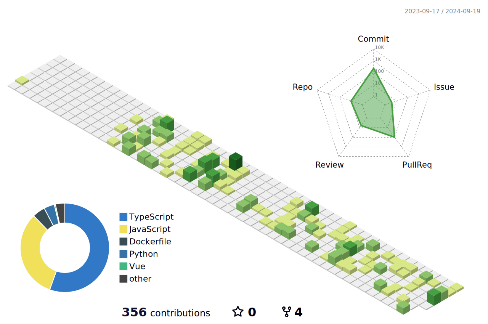

<!--
 -->

<!-- https://img1.daumcdn.net/thumb/R1280x0/?scode=mtistory2&fname=https%3A%2F%2Fblog.kakaocdn.net%2Fdn%2FdoR7Cm%2Fbtss856Oxxk%2FMK5dTbdK4vcHcU6OpkOb70%2Fimg.png -->

  <b>👩‍💻 프론트엔드 개발자 🍀</b>
   
  

    
✍️ 기술 블로그 운영 | 🧩 새로운 기술에 빠르게 적응 | 🏃 꾸준함</li>
  

<h3 align="center">🛠 Tech Stack 🛠</h3>

</a>
</a>
</a>
</a>
 
</a>
</a>
</a>

<h3 align="center">🌈 Follow Me 🌈</h3>

  &nbsp
  

 
<!--  -->

<!--  -->

